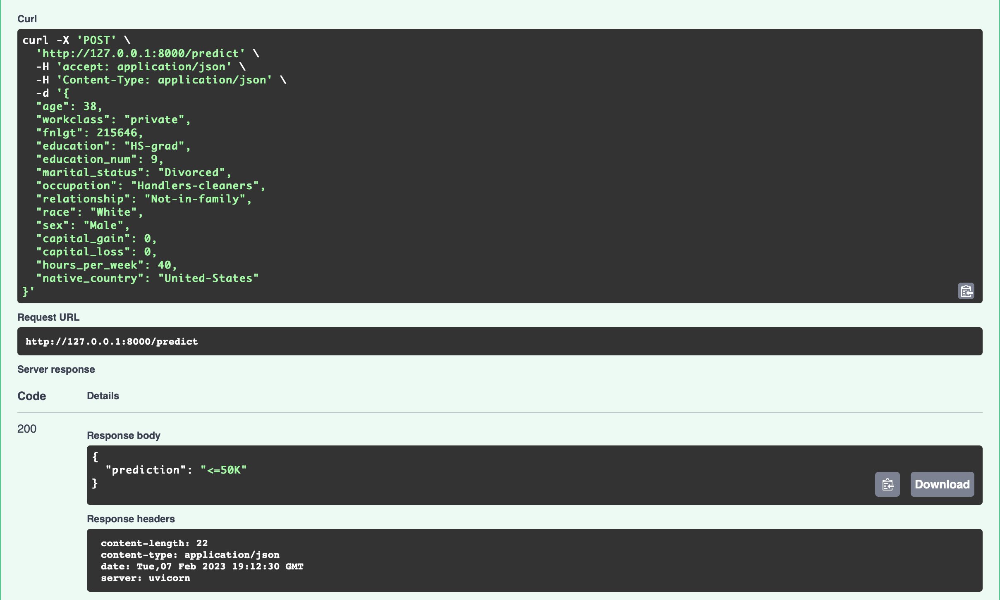
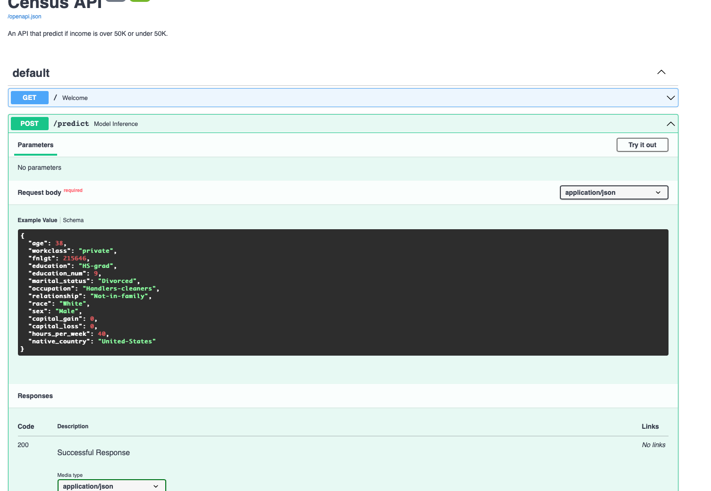
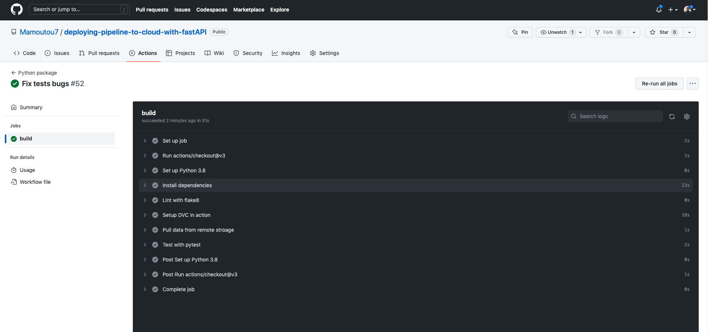
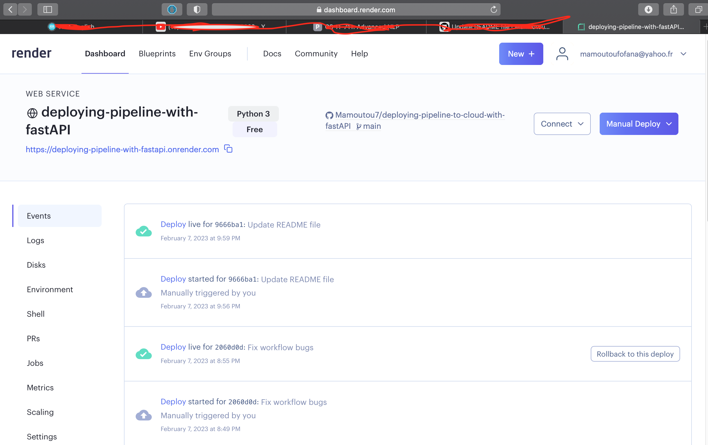

# Project Overview
This is the project of Udacity's ML DevOps Engineer nanodegree. Objective is to deploy a ML model with FastAPI on Render.

Author: Mamoutou FOFANA

Date: 07/02/2023

The project follows these steps:
- Train a ML model on a classification task to predict salary group of individuals based on 14 various characteristics. The threshold salary used is $50,000. You can refer for the detailed modelCard [here](https://github.com/Mamoutou7/deploying-pipeline-to-cloud-with-fastAPI/blob/main/starter/model_card_template.md) for details on the model and dataset used
- Expose the model for inference using a FastAPI app
- Deploy the app using Render to provide inference endpoint
- Implement Continuous Integration / Continuous Deployment workflow using Github actions, github repository and Render integration with Github. The app is only deployed if integrated, automated, tests are validated by Github actions upon modifications

# Using the API client
* App is deployed to Render from github repo with CI/CD enabled (all implementation steps operated from Render GUI, ie Render app creation to deployment). Automatic deployments are performed only if Github actions continuous integration validation passes
* Key files required by Render: requirements.txt + python scripts + saved models.
* Once deployed and the Render app url triggered in the browser, the welcome message is displayed
* Inference can be performed using the dedicated script "test_api_live.py". The script posts a sample item (14 features) to the app url/inference and the prediction is returned (together with the submitted sample item details). The inference is performed by the main.py module using the trained model and OneHot encoder saved in the ./model folder
* See the screenshots as illustrations [here](https://github.com/Mamoutou7/deploying-pipeline-to-cloud-with-fastAPI/blob/main/starter/screenshots/continuous_deloyment.png)

 # Environment and Set-up                                            
 The project is conducted under macOS. Python 3.8 is used inside a virtual environment. Necessary packages are provided in the requirements.txt file also used for the Render deployment. A log file captured the training results and screenshots are provided to document the major achievements of the project.
- inference FastAPI
 
 
 - inference output from endpoint
 
 
 - CI Github actions validation
 
   
 - CD Render validation
 

The initial project instructions are provided below for information. Refer to the repo content for the actual implementation.

# INITIAL PROJECT INSTRUCTIONS

Working in a command line environment is recommended for ease of use with git and dvc. If on Windows, WSL1 or 2 is recommended.

# Environment Set up
* Download and install conda if you don’t have it already.
    * Use the supplied requirements file to create a new environment, or
    * conda create -n [envname] "python=3.8" scikit-learn pandas numpy pytest jupyter jupyterlab fastapi uvicorn -c conda-forge
    * Install git either through conda (“conda install git”) or through your CLI, e.g. sudo apt-get git.
    
## Repositories
* Create a directory for the project and initialize git.
    * As you work on the code, continually commit changes. Trained models you want to use in production must be committed to GitHub.
* Connect your local git repo to GitHub.
* Setup GitHub Actions on your repo. You can use one of the pre-made GitHub Actions if at a minimum it runs pytest and flake8 on push and requires both to pass without error.
    * Make sure you set up the GitHub Action to have the same version of Python as you used in development.

# Data
* Download census.csv and commit it to dvc.
* This data is messy, try to open it in pandas and see what you get.
* To clean it, use your favorite text editor to remove all spaces.

# Model
* Using the starter code, write a machine learning model that trains on the clean data and saves the model. Complete any function that has been started.
* Write unit tests for at least 3 functions in the model code.
* Write a function that outputs the performance of the model on slices of the data.
    * Suggestion: for simplicity, the function can just output the performance on slices of just the categorical features.
* Write a model card using the provided template.

# API Creation
*  Create a RESTful API using FastAPI this must implement:
    * GET on the root giving a welcome message.
    * POST that does model inference.
    * Type hinting must be used.
    * Use a Pydantic model to ingest the body from POST. This model should contain an example.
   	 * Hint: the data has names with hyphens and Python does not allow those as variable names. Do not modify the column names in the csv and instead use the functionality of FastAPI/Pydantic/etc to deal with this.
* Write 3 unit tests to test the API (one for the GET and two for POST, one that tests each prediction).

# API Deployment
* Create a free Heroku account (for the next steps you can either use the web GUI or download the Heroku CLI).
* Create a new app and have it deployed from your GitHub repository.
    * Enable automatic deployments that only deploy if your continuous integration passes.
    * Hint: think about how paths will differ in your local environment vs. on Heroku.
    * Hint: development in Python is fast! But how fast you can iterate slows down if you rely on your CI/CD to fail before fixing an issue. I like to run flake8 locally before I commit changes.
* Write a script that uses the requests module to do one POST on your live API.
